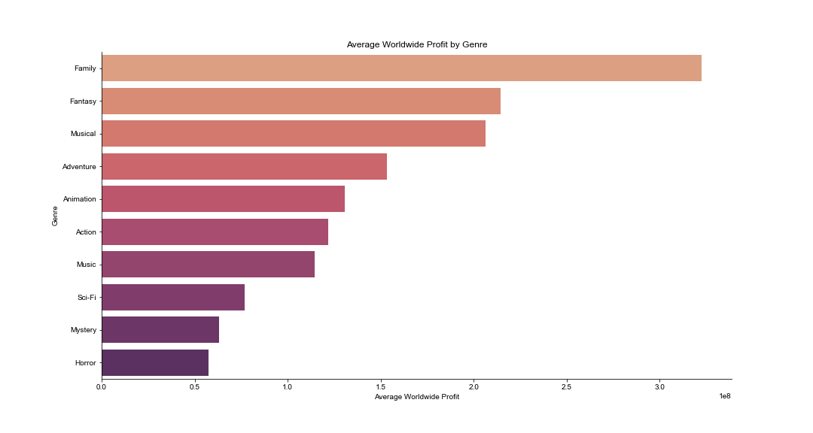
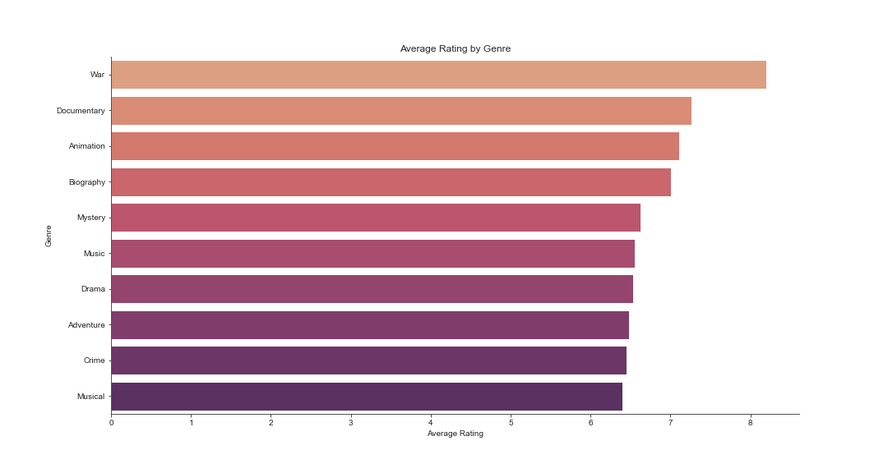
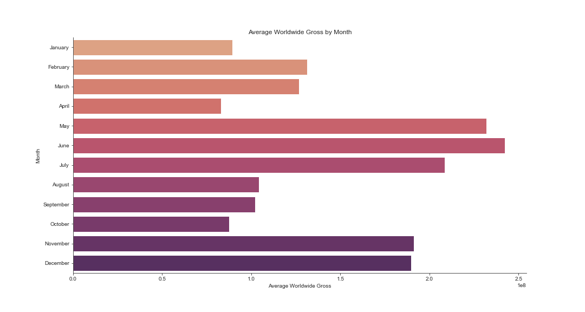

# Analysis on Entering the Movie Making Business

The goal of this repository is to provide business recommendations for Microsoft as they try to enter the movie making business. This analysis examines thousands of movies across multiple genres, production costs, and decades to provide the executives at Microsoft key insights to keep in mind as they enter the entertainment industry.


# Business Problem

Microsoft wants to enter the entertainment industry, specifically the movie making industry. Since Microsoft does not have any direct experience in this domain, executives are unsure what the expected gross profits, what type of movie to produce, and timeline for production and release are.
This analysis was conducted to provide Microsoft insight into the trends, performances, and history of movies released up to 2018.

# Data

This analysis was conducted using data from two main sources:

    1. Box Office Mojo
    2. IMdB

The raw csv files of these datas can be found in the ```zipped_data``` folder.
The specific files used included: ```tn.movie_budgets.csv```, ```bom.movie_gross.csv```, ```tmdb.movies.csv```, ```imdb.title.basics.csv```, and ```imdb.title.ratings.csv```.

The metrics analyzed dealt primarily with each movie's financials, genres, and time of release.

This analysis was performed using Python and the code can be found in ```Phase 1 Project.ipynb```.

# Results

## The most profitable genre on average is 'Family'

The analysis for profitability was conducted by examining the average production costs and the domestic and international gross of almost 4000 movies across 20 different genres. Through this analysis it was discovered that the 'Family' genre is the most profitable of average where one can expect a profit of $320,000,000 if profitability is the primary goal for Microsoft entering the entertainment industry. 
The top ten worldwide profitable genres are represented in the chart below.


## The highest rated genre is 'War'

The analysis for exceptionalism was conducted by examining the number of votes and the rating of the votes for over 6000 movies across 20 different genres. This analysis found that if accolades in the entertainment industry are the primary goals of Microsoft, then a 'War' genre movie will give the highest chances of garnering recognition.


## The most optimal month to release a movie is in 'June'

The analysis for release date was conducted by examining the release dates of over 1500 movies across the 12 months in the year while cross referencing the average worldwide gross upon release. This analysis found that the most profitable months to release a movie is in the month of 'June', with 'May' and 'July' as comparable options as well. This will help provide the team at Microsoft a structured timeline as they begin the process of planning, producing, and releasing their new film.


# Conclusions

This analysis provides three recommendations to the Microsoft executive team:
1. If profitability is the goal; a <b>'Family'</b> genre movie should be funded, produced, and released to maximize profits gained. 

2. If recognition is the goal; a <b>'War'</b> genre movie should be produced as this genre has garnered the highest average recognition and fame on average to date.

3. The target release date of the movie produced should be in the month of <b>'June'</b>. June has proven to show the highest number of viewership and ticket sales, and thus should maximize potential profitability and recognition.

## Next Steps

Additional anlyses could yield additional insights to provide more specific recommendations to Microsoft:

- Distinguishing between domestic and international profitability. This recommendation could use existing data, but would provide more specific insights on profitability depending on the target audience desired.
- Identifying the best genre of movie for both profitability and recognition. This recommendation would require deeper analysis with existing data, but provide a more gradient recommendation that is balances priorities.
- Predicting what genres to avoid. This modeling would identify genres that have performed poorly which would shorten the list of viable options available.

jupyter nbconvert --to markdown README.ipynb


```python

```
